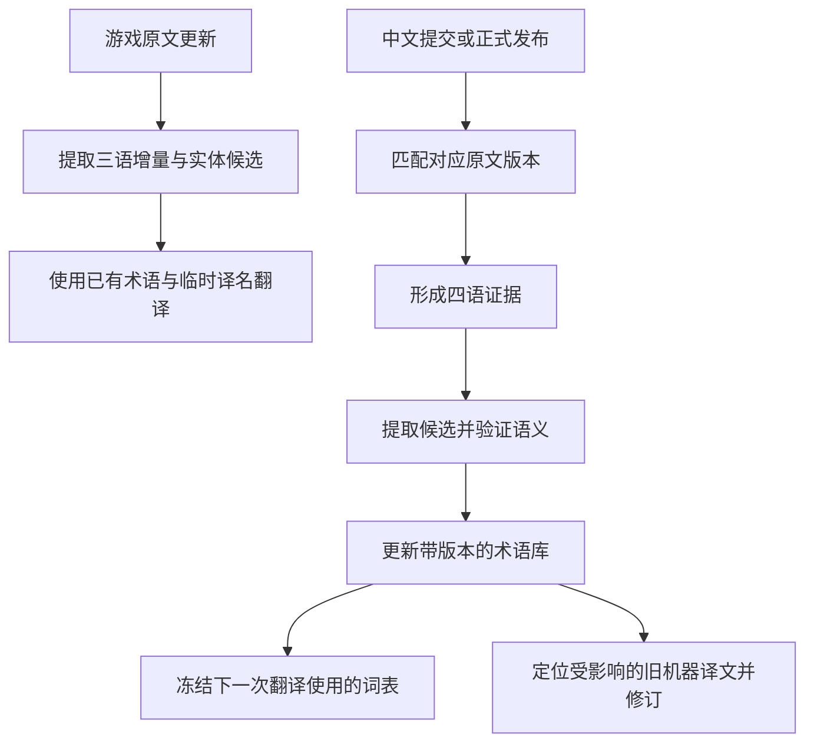

# 会话归档：架构调整、四语增量术语库与 Jev

- 日期：2026-09-25（Asia/Shanghai）
- 项目：`LCTA_auto_update`
- 本次调查对应提交：`093cf2aee3f8e8039afe308f6fc1573b7af75336`
- 提交说明：`chore: 先用本地静态表顶包`
- 归档范围：用户原始需求、助手过程说明、两轮完整分析答复、澄清问答、调查依据、外部资料与待验证事项。
- 本次工作的性质：代码与历史样本调查、公开文档检索、架构方案设计。方案尚未实施，也未调用翻译模型或 Jev API 做效果测试。
- 阅读约定：下文“官方翻译”按本次会话语境指都市零协会／LLC 正式发布译文；不能仅凭仓库、分支或目录名称认定某份中文内容已经正式审核。
- 文档中的本地文件链接已整理为仓库内相对链接。历史样本位于被 Git 忽略的 `benchmark/`，其他工作副本中可能没有这些文件；关键观测值已在本文保留。

## 导航

1. [第一轮：现有架构调查与可选方案](#第一轮现有架构调查与可选方案)
2. [第二轮：四语提交匹配与 Jev](#第二轮四语提交匹配与-jev)
3. [归档请求](#归档请求)
4. [调查记录与证据索引](#调查记录与证据索引)
5. [后续继续工作的边界与待决事项](#后续继续工作的边界与待决事项)

## 第一轮：现有架构调查与可选方案

### 用户原始请求

> 在本项目中，我们原有的会自动更新的专有名词列表端点被改为了私有，我们没法访问。我们现在只有被部署到本地的[https://web.lcta.top/proper_terms_paratranz.json](https://web.lcta.top/proper_terms_paratranz.json) 静态列表。查看项目，分析我们项目的未来怎么计划。我打算乘这次机会顺便好好的修改一下项目的架构，使得产出的译文与官方翻译更加一致且使译文本身也更具一致性。给我几个可选方案。

### 助手过程说明

1. 我先梳理项目当前的翻译流程、专有名词端点的调用位置、缓存与构建方式，再对照现有静态词表的格式，最后给出几套从小改到重构的可选架构方案和推荐路径。
2. 确认了两个会影响方案选择的事实：代码已经改为读取你给的静态词表；项目也已经实现了“模型发现新词并在运行中共享”，所以旧规划中“没有跨文件术语机制”的判断已过时。现在更值得解决的是：新词如何获得可信译名、并发翻译如何使用同一版本的术语，以及如何从 LLC 已发布译文中复用句子和规则。
3. 发现一个关键的断点：新词虽然会保存，但自动更新把它写进临时目录，打包时没有带走，也没有在下次运行恢复，因此当前自动发布流程并没有真正积累新词。另外，去重只看游戏版本；即使 LLC 后来发布了正式译文，同一游戏版本也会被跳过。要让译文持续向 LLC 靠拢，这两处需要一起纳入架构设计。

### 助手完整分析答复

**我推荐把项目逐步改成“权威语料优先、模型补全、发布后持续校正”的系统。** 静态词表可以继续作为基础，但未来的一致性应主要来自 LLC 已发布译文、带上下文的术语库，以及每次翻译前统一确定的译名。

下面把你说的“官方翻译”理解为项目目前采用的 **都市零协会／LLC 正式发布译文**。本次只做了代码、历史样本和端点检查，没有修改项目或调用翻译模型。

**当前最值得关注的几个事实**

| 发现 | 对后续架构的影响 |
|---|---|
| [词表获取代码](../src/translateFunc/get_proper.py)已经改为读取静态 JSON；本次返回 **2,000 条**，其中 **532 条长度不超过两个字符** | 换端点已经完成，但尚无版本快照、内容校验和本地故障回退 |
| 已有字段级 LLC 译文复用、固定翻译示例，以及角色／状态效果的优先处理 | 这些能力应保留；新增价值主要在跨位置复用、上下文检索和持续校正 |
| 已有模型新词收集、投票和运行内热更新 | 问题已经从“有没有共享”变成“共享的译名是否可信、所有文件是否使用相同版本” |
| 新词默认写入临时输出根目录，自动更新只搬走其下的汉化包目录 | **当前自动发布流程没有真正实现跨运行的新词积累**，见[保存位置](../src/translateFunc/pipeline.py)和[运行编排](../src/auto_update/runner.py) |
| 自动去重只检查游戏 raw token，而且发生在获取 LLC 最新版本之前 | **LLC 后续发布正式译文时，同一游戏版本会被跳过**，无法自动完成向正式译文的收敛 |

另外，[消歧结果的应用](../src/translateFunc/processor.py)仍然是把某个词从整个请求中移除，不能表达“这个词在第一个句子里是人名，在第二个句子里是普通词”。

这不是小概率边界情况。静态表中就有：

- `이상`：人名“李箱”，技能语境也可能是“不低于”。
- `피주머니`：剧情“血袋”、BUFF“血囊”。
- `호위무사`：不同公司背景分别使用“护卫武士”和“侍卫”。

所以，**一致性的单位应是“同一实体或同一含义”，不能只是“同一韩文字符串”。**

**三个可选方案**

| 方案 | 核心变化 | 对齐 LLC 的收益 | 项目内一致性 | 投入 |
|---|---|---|---|---|
| A．维护自己的术语资产 | 静态表＋可信增补＋版本管理 | 主要改善名称 | 改善术语一致性 | 较小 |
| **B．建立权威翻译记忆库** | 已有译文复用＋相关例句检索＋术语校准 | 同时改善名称、句式、风格 | 改善术语和重复句一致性 | 中等 |
| C．按实体与场景组织翻译 | 全局分析与定名，再分组翻译、统一复核 | 更适合新剧情与复杂内容 | 对新内容的一致性控制最强 | 较大 |

三个方案可以递进实施，不必一次选定后全部重写。

**方案 A：把静态词表升级成可维护的本地术语资产**

适合优先恢复稳定运行、控制维护成本。

主要改动：

1. **保存可追溯的词表快照。** 仓库保留基础静态表，远程刷新成为可选步骤；记录来源、获取时间、内容哈希，刷新失败使用最近有效版本。
2. **区分已确认译名和模型候选。** 模型发现的新词先进入候选区；重复投票只能提供参考，不能直接证明译名正确。
3. **给术语增加适用范围。** 至少记录实体类别、剧情／技能等用途、章节或组织背景、来源证据和状态。
4. **每次正式翻译使用固定词表版本。** 翻译过程中收集的新候选进入下一轮处理，避免先完成的文件决定后续文件的译名。

目前新词默认一票即可入选，累积到阈值就热更新；匹配引擎对同词采用已有条目优先。这可能让并发完成顺序影响最终采用的名称。固定快照可以消除这类不确定性。

**局限：** 能统一“叫什么”，但对“这句话应该怎样写得像 LLC”帮助有限，也不能自动获得尚未公开的新官方译名。

**方案 B：建立权威翻译记忆库——最推荐**

把 LLC 的历史译文当作可查询、可复用的数据资产。

翻译每个字段时按以下顺序处理：

> 检查现有 LLC 覆盖 → 查找同源同语境译文 → 检索相关正式例句 → 模型补全 → 校验并记录来源

这里需要建设三个模块：

- **平行语料库：** 保存 KR／JP／EN／中文、文件、条目 ID、字段路径、内容类型、版本和来源。
- **翻译记忆：** 相同原文且语境兼容时直接复用；存在多个合法译法时按实体、用途和上下文选择。
- **动态例句检索：** 对未命中的内容，选取同角色、同类技能机制或同界面的 LLC 例句，替代仅依赖固定示例。

这条路线在项目里有实际基础。我重新统计了本地两个历史待翻数据集：

| 数据集 | 待翻字段 | 不同韩文字符串 |
|---|---:|---:|
| 2026072401 | 898 | 688 |
| 2026080601 | 98 | 68 |

存在明显重复，包括同一 E.G.O 名称在不同文件出现、同一句技能描述在不同等级出现。**这些数字只说明有合并与复用机会，不等于可直接复用的比例**；短句、说话人和不同语境仍需区分。

术语更新也可以从这里获得证据：

- 对角色、BUFF、技能等结构化名称，优先通过稳定 ID 对齐正式译名。
- 对剧情中的新词，从正式平行句中提取候选，并保留上下文证据。
- 正式译文出现后，替换对应的临时译名，并找出受影响的机器译文字段。

初期用 **SQLite＋精确索引＋词面检索**就够了。向量检索可以以后用来补充相似例句召回，不需要作为首期依赖；相似句也只作为参考，不能直接覆盖输出。

**局限：** 最难的部分是正确对齐版本、处理同句多译和数据来源。基础语料做错，复用会稳定地传播错误。

**方案 C：从“逐文件翻译”改成“先统一决策，再分组翻译”**

适合把新章节、角色对白和新增复杂机制的质量作为长期重点。

流程变为：

1. **扫描本次全部增量。** 找出重复内容、新实体、跨文件引用和需要消歧的词。
2. **统一确定本轮译名与约束。** 已有正式译名直接采用；未知实体集中决定临时译名，记录依据与适用范围。
3. **按内容组织翻译。** 剧情按场景并保留说话人和前后文；技能按实体及其等级、效果描述组织；UI 按界面用途组织。
4. **执行跨文件一致性检查。** 检查同实体异名、同类机制句式差异及正式译名冲突，再定向修复。

这要求建立独立于 JSON 文件结构的“翻译单元”。至少保留文件、字段、说话人、实体、场景和相邻文本。目前请求主要保留 KR／JP／EN 文本，很多有助于判断语义的信息没有完整传到模型。

**局限：** 调度、上下文组织和复核成本都更高；全局定名一旦错误，影响范围也更大，因此仍必须区分正式译名和临时决策。

**无论选哪套方案，都需要守住的设计原则**

- **路径相同不代表译文仍然有效。** 当前覆盖判断主要检查是否有译文，没有验证该译文对应的原文是否已变化。建立记忆库时必须保存原文版本或指纹，不能把“最新原文＋较旧中文”直接认定为可靠平行语料。
- **保留语义相关格式。** 做同句匹配时不能随意删除空格、标点、数字、占位符和游戏标签；它们可能影响机制含义或显示。
- **正式语料与机器产出分开保存。** 机器译文可以复用，但必须保留其身份，不能循环进入“官方证据”库。
- **构建版本需要反映全部关键输入。** 建议由游戏版本、LLC 版本及资产哈希、术语版本、翻译策略版本共同决定是否重建，并增加 LLC 更新后的再协调入口。
- **评测只看当时能获得的资料。** 用旧版正式译文作为输入、后续正式译文作为参考答案；不能把答案提前放进检索库。重点统计新增／修订字段的质量、术语冲突和重复句一致性，避免大量直接复制的旧字段掩盖问题。

仓库中的[旧收敛方案](converge-to-authority.md)提出“检索优先”的方向值得延续，但其中的全量存量覆盖率不能直接当作新增内容的检索收益；部分实现现状也已经变化。

**我的具体建议**

选择 **B 作为主线，先完成 A 的数据管理基础，再吸收 C 的“全局定名、固定快照”部分**：

1. 先解决词表快照、新词持久化、来源分级，以及 LLC 更新后能重新构建。
2. 建立带版本证据的翻译记忆库，先上线可靠的精确复用和重复任务合并。
3. 加入按内容类型检索正式例句、结构化名称对齐和术语冲突报告。
4. 根据真实评测结果，再决定是否引入完整的场景翻译、向量检索或更复杂的模型流程。

架构上保留现有下载、打包和发布层，在翻译核心旁增加独立的语料与术语模块，通过明确接口接入。这样可以逐步替换现有能力，也能减少今后同步上游翻译核心时的冲突。

## 第二轮：四语提交匹配与 Jev

### 用户原始请求

> 对于每一次更新的commit，我们可以通过四语匹配来尝试获取专有名词。设计一下路线思路。此外，我听说了一个叫做jev的新发明，你搜索一下，思考一下能不能融入我们的项目中

### 助手过程说明与澄清

助手：

> 我会把“四语匹配”细化成按提交提取候选、验证译名、回流术语库的路线，同时搜索你提到的“jev”，确认它具体指什么，再判断适合接入哪个环节。

助手通过异步问题澄清：

> 你提到的“jev”有原始链接、完整名称，或介绍它的一句话吗？这个缩写可能对应不同技术；我会继续搜索，并先完成四语增量术语库的设计。

用户回复：

> [https://docs.typesafe.ai/introduction/quickstart](https://docs.typesafe.ai/introduction/quickstart)

助手：

> 你给的链接确认了：Jev 是 TypeSafe 的结构化决策模型，适合判断“某个译名是否适用于这段文本”或“几个候选是否指向同一实体”。我已找到官方文档；接下来重点核查它的多语言限制和置信度含义，再把它放进四语术语提取流程。

### 助手完整分析答复

**这条路线可行，而且应当成为术语库的主要更新方式：从每次更新中积累“四语对齐证据”，再把证据转成有适用范围、有版本记录的术语。Jev 适合放在候选筛选、实体匹配和逐处消歧这几个环节。**

我查看了你提供的文档及相关官方说明。下面是建议的整体设计；尚未调用 Jev 做实际效果测试。

**1．先把“每个 commit”变成可追踪的四语增量**

四种语言往往不同步更新。游戏更新时可能只有 KR／JP／EN，中文过一段时间才补齐。因此建议采用两个相互衔接的流程：



**commit 是发现变化的入口，真正的分析单位应当是“发生变化的字段”。**

每条四语证据至少保存：

| 信息 | 用途 |
|---|---|
| 仓库、各语言提交 SHA／资源版本 | 确认原文与译文来自哪里 |
| 文件、实体类别、条目 ID、字段路径 | 对齐四语，追踪后续修订 |
| 四语原文、内容哈希 | 去重、缓存与重放 |
| 说话人、章节、所属实体、相邻文本 | 判断同词不同义 |
| 中文来源及发布状态 | 区分正式译文、未发布修改、机器译文 |
| 对齐方式与可信程度 | 防止错误配对进入术语库 |

具体对齐规则：

- 统一 `KR_／JP_／EN_` 等文件前缀，再按**文件类别＋稳定 ID＋字段**匹配。
- 嵌套数组优先使用自身 ID、等级等稳定标识，避免按数组位置硬配。
- 剧情缺少稳定 ID 时，结合说话人、前后文本和顺序对齐；无法确认的保留待处理状态。
- **不能仅凭时间接近，把最新中文和最新原文拼成一组。** 无法确认版本对应时，降低证据等级。
- 没有变化的字段不重复提取；相同内容在多个 commit 中出现，也不增加“支持票数”。

有个现有数据需要特别注意：本地历史样本的[元数据](../benchmark/updates/2026080601/update_meta.json)中，`llc_ref` 指向的提交记录为 `Auto GTP Update`。仅凭目录名或 `llc_ref` 标签，不能认定它是已经审核的正式译文；需要核实来源。

**2．术语提取分三路，先做最可靠的部分**

| 提取路线 | 方法 | 建议优先级 |
|---|---|---|
| 结构化名称 | 从角色、BUFF、E.G.O、技能等同 ID 的名称字段直接建立四语对应 | 第一优先 |
| 正式译名修订 | 同一实体原文未变，中文名称发生修改，记录新旧译名与生效版本 | 第一优先 |
| 正文中的专名 | 从四语平行句中提取词语片段，再验证它们是否指向同一实体／含义 | 第二阶段 |

**结构化名称是最好的起点。** 同一个 BUFF 的四语 `name` 字段，通常比在四个长句中猜词语对应关系可靠得多。不过，技能名称可能是一整句，应标成“实体名称”，不能直接变成到处适用的普通短语规则。

正文提取则建议这样做：

1. 用已有词表、名称索引、重复短语和名词识别召回候选。
2. 对复杂内容，让生成模型提出四语对应片段。
3. 要求每个片段都能定位到原文；程序验证片段确实存在。
4. 验证候选是否是专名、四语是否同义、当前语境是否适用。
5. 查历史证据，决定新建实体、增加别名，还是记录冲突。

这里应当让模型**抽取已有中文译文中的名称**。需要新造译名时，放入单独的临时译名流程，不能当作从正式中文中发现的证据。

四语能帮助消歧，但不是四张独立选票：不同语言本身也可能有误译、意译或省略。允许出现“对应表达缺失／无法确认”，比强行凑齐四项更可靠。

**3．术语库围绕“实体和含义”组织**

不要继续只用：

> 韩文字符串 → 一个中文字符串

建议改成：

> 实体／含义 → 四语名称与别名 → 适用范围 → 支持证据 → 历史版本

例如，`이상` 至少需要区分：

| 含义 | 中文处理 | 适用依据 |
|---|---|---|
| 人物姓名 | 李箱 | 角色身份、说话人、对应外语姓名 |
| 数值比较 | 不低于／以上等 | 技能语境、数字及对应外语表达 |

同样，“血袋／血囊”应当是不同用途的规则，不能让投票最多的译法覆盖全部场景。

建议把两种状态分开记录：

- **来源状态：** 正式发布、未发布修改、机器生成。
- **提取状态：** 待验证、已确认、冲突、已被新版本替代。

这样，“模型非常确信”也不会把机器候选变成正式译名。一次正式名称字段的可靠对应，可以比几十处复制粘贴的正文出现更有价值。

每次翻译开始时冻结术语版本。新发现的词先收集，统一处理后再影响后续批次，避免并发顺序决定采用哪个名称。

**4．Jev 的能力与合适位置**

根据 [TypeSafe 官方介绍](https://docs.typesafe.ai/introduction)，Jev 接收文本状态和结构化问题，提供三种输出：

| 类型 | 输出 | 本项目用途 |
|---|---|---|
| `Noul` | “是”的概率 | 两个候选是否指向同一实体 |
| `Choice` | 候选选择及概率分布 | 当前出现位置属于哪个含义 |
| `Score` | 按预定义等级评分 | 例句相关性、候选证据支持程度 |

多个问题可以在一次请求中独立评估。官方也有[实体对齐案例](https://docs.typesafe.ai/cookbooks/entity_alignment)，与我们的候选合并任务比较接近。

我建议按以下顺序接入：

**第一处：替换部分现有的阶段 0 消歧。**

当前系统已经召回术语，再调用模型判断是否适用。这个任务答案范围明确，最适合试验 Jev。

对每个**具体出现位置**提问，例如：

> 此处的 `이상` 属于：人物姓名／数值比较／其他含义／信息不足？

输出必须绑定字段及出现位置。不能把一次“不适用”扩展成整份文件都禁用该术语。这也能直接改善当前[按整词移除引用的逻辑](../src/translateFunc/processor.py)。

**第二处：验证四语提取出的候选。**

给 Jev 一小组四语上下文及候选片段，分别判断：

- KR 片段是否是完整的名称，而非更长词的一部分？
- CN 片段是否指向同一实体或含义？
- JP／EN 是否支持这个解释？
- 当前证据是否存在语义冲突？

这些判断分别输出，由程序组合。不要把“提取、对齐、验证、决定是否入库”塞进一道大问题，也不要直接把各项概率相乘当作可靠性。

**第三处：筛选正式译文例句。**

先用实体、关键词和文本检索取得少量候选，再让 Jev 判断哪个例句的机制、角色或语境最接近。选出的例句交给现有翻译模型使用。

**最终译文生成、全新译名创作仍交给生成模型。** 官方明确说明 Jev 不适合自由生成；它可以从已经提供的片段中选择答案。[已知限制](https://docs.typesafe.ai/model-jaggedness/jev-1.13)

**5．接入前，有三项必须实测**

首先，**中日韩语能力是最大的不确定项。** 官方说明英语是主要训练语言，其他语言包括 CJK 的表现并不相同。因此，英文对照可以提供辅助，但不能据此认定它可靠理解韩文短词、中文译名和日文双关。[模型说明](https://docs.typesafe.ai/models)

其次，**`confidence = 0.95` 不代表在本项目中有 95% 正确率。** Choice／Score 的 confidence 来自输出概率分布的集中程度，阈值需要用我们的标注样本校准；Noul 则没有单独的 confidence 字段。[置信度说明](https://docs.typesafe.ai/confidence)

最后，收益要看整个流程。当前官方标价是 **每百万输入 token 0.042 美元，输出免费**，有吸引力；但候选提取、低置信度回退、重试和网络耗时仍要计入。不能把宣传中的速度倍数直接套到我们的任务上。[价格与限制](https://docs.typesafe.ai/models)

建议把 Jev 封装成可替换的判断服务：关闭、超时或表现不达标时，沿用已有消歧模型；不确定的候选继续留在候选区。固定模型版本，并缓存“输入＋问题规则＋模型版本”的结果。

**6．建议的实施路线**

| 阶段 | 交付内容 | 验证重点 |
|---|---|---|
| ① 四语增量底座 | 提交追踪、字段对齐、来源记录、中文延迟补齐 | 对齐准确率，尤其是数组变动和剧情插行 |
| ② 名称与修订回流 | 结构化名称提取、译名历史、固定术语快照、持久化 | 正式译名能否正确覆盖临时译名 |
| ③ Jev 对照实验 | 同一批候选分别跑现有消歧和 Jev；先只记录结果 | 误套术语率、漏用率、回退率、费用及延迟 |
| ④ 正文扩展 | 四语片段提取、实体合并、例句检索 | 入库精确率、同实体跨文件一致性 |
| ⑤ 发布后修订 | 保存“字段使用了哪些术语”的关系，定向重译 | 新正式译名出现后，相关机器译文能否完整更新 |

评测样本应专门包含短词、同形异义词、称呼、旧译名修订、四语不完全对应等难例，并按实体、重复句组和更新时间隔离测试数据。

**首个小版本建议只做：结构化名称四语对齐＋译名修订记录＋Jev 逐处消歧对照。** 这三件事既能产生实际可用的术语资产，也能用明确的结果判断 Jev 是否值得扩大使用。

## 归档请求

用户：

> 将本次会话的所有内容落盘为文档以供之后参考

助手：

> 我会将本次会话整理成项目文档，保留你的原始需求、两轮分析与路线设计、代码依据、Jev 资料链接，以及尚待验证的结论，方便后续继续推进。

## 调查记录与证据索引

本节保存调查中读取到的关键事实与可复核位置，补充上述对话正文。工具原始返回中的大段源码、整份词表、网页 HTML 与重复输出不逐字复制；其来源、有效结果及访问限制记录如下。

### 项目边界与现有实现

| 文件／目录 | 调查内容与用途 |
|---|---|
| [README.md](../README.md)、[architecture.md](architecture.md) | 下载／发布适配层与翻译核心的边界；上游同步约定；现有运行说明 |
| [next-iteration-plan.md](next-iteration-plan.md) | 既有诊断与迭代建议。部分描述早于当前实现，须重新验证 |
| [converge-to-authority.md](converge-to-authority.md) | 既有权威语料检索方案。其全量覆盖率不能直接代表增量收益 |
| [src/config.yaml](../src/config.yaml) | 自动发布实际配置 |
| [translateFunc/config.py](../src/translateFunc/config.py) | 翻译核心配置与新词默认开关 |
| [get_proper.py](../src/translateFunc/get_proper.py) | 静态词表 HTTP 获取；当前没有旧 API 的分页逻辑 |
| [matcher/proper.py](../src/translateFunc/matcher/proper.py) | 词表加载、上下文分析与置信度辅助逻辑 |
| [proper/analyze.py](../src/translateFunc/proper/analyze.py) | 三语上下文提取。现有按路径位置提取不能替代新方案所需的版本与实体对齐器 |
| [matcher/engine.py](../src/translateFunc/matcher/engine.py) | 四个 AC 匹配器、词表热更新与按 term 保存的词条 |
| [matcher/ac_automaton.py](../src/translateFunc/matcher/ac_automaton.py) | 精确子串召回。现有返回项不包含每次命中的字符起止位置 |
| [proper/new_terms.py](../src/translateFunc/proper/new_terms.py) | 模型候选过滤、计票、热更新队列、落盘与基础词表优先合并 |
| [pipeline.py](../src/translateFunc/pipeline.py) | 优先处理角色及状态效果定义，编排其余文件，加载和保存新词 |
| [processor.py](../src/translateFunc/processor.py) | 覆盖判断、阶段 0 消歧、翻译、降级重试、规则修复及结果重建 |
| [builder/request.py](../src/translateFunc/builder/request.py) | 三语文本块、术语及效果引用、请求分片与上下文传递 |
| [builder/examples.py](../src/translateFunc/builder/examples.py)、[builder/stages.py](../src/translateFunc/builder/stages.py) | 固定正式译文示例与阶段策略 |
| [validator.py](../src/translateFunc/validator.py) | 确定性格式和状态效果引用校验 |
| [auto_update/runner.py](../src/auto_update/runner.py) | raw token 去重、临时目录、LLC 获取、翻译与打包 |
| [check.yml](../.github/workflows/check.yml) | 自动发布触发、环境、Release 及诊断产物上传 |
| [test_new_terms.py](../tests/test_new_terms.py)、[test_field_coverage.py](../tests/test_field_coverage.py) | 已有新词与字段覆盖行为的测试参考 |
| [test_retry_escalation.py](../tests/test_retry_escalation.py)、[test_rule_repair.py](../tests/test_rule_repair.py) | 当前已存在的降级重试和规则修复能力 |

调查时的重要配置：

- `translation.translation_mode: multi_stage`
- `translation.disambiguation_mode: hybrid`
- `translation.max_workers: 4`
- `translation.min_confidence: low`
- `translation.api.temperature: 0.6`
- `features.enable_proper: true`
- `features.auto_fetch_proper: true`
- `features.enable_self_check: false`
- `features.enable_rule_validation: true`
- `features.enable_rule_repair: false`
- 翻译核心默认 `enable_new_terms=True`、`new_terms_min_votes=1`、`new_terms_hot_update=True`、`new_terms_hot_update_batch=20`。
- 自动更新配置构造没有指定持久化的 `new_terms_path`，因此沿用临时输出目录下的默认位置。

具体实现观察：

1. `get_proper.fetch()` 通过 `requests.get(..., timeout=10)` 获取静态词表并直接返回 JSON；`min_len` 参数在当前实现中未实际过滤。
2. `ProperAnalyzer.fetch_terms()` 的自动获取分支读取远程静态表，手动分支读取指定本地 JSON；没有自动的远程失败转本地快照机制。
3. `_collect_ambiguous_terms()` 中 `hybrid` 仍收集全部匹配术语；代码说明真正的上下文 confidence 过滤尚需集成。
4. `_apply_disambiguation()` 将不适用的 term 从请求共享参考和各块引用中全部删除，没有保留逐处负向约束或把 `actual_meaning` 作为后续硬性决策传递。
5. `_field_covered()` 检查空译文和韩文原样回填等情况，但不对照该中文原本对应的历史 KR 指纹。
6. `MatcherEngine.add_proper_terms()` 只添加尚未存在的 term。已有 term 不在热更新时被新候选替换；同形多义不能依靠当前单键结构完整表达。
7. `pipeline-output/proper_learned.json` 与 `pipeline-output/LLc-CN-LCTA/` 是同级路径。自动更新搬走后者，前者随临时目录结束而消失；工作流也未配置恢复这一资产。
8. `_select_release_version()` 以 raw token 找已发布版本并提前返回；LLC 最新版本是在去重之后获取。
9. 历史规划中的“最多 10 页 × 800 条”和“完全不存在跨文件术语共享”均不代表当前提交的实现。
10. 评测目录 `benchmark/` 被整体忽略；调查时目录里有缓存、历史数据和运行产物，`git ls-files benchmark` 无输出。后续评测能力应有可版本管理的实现与数据清单。

上述内容为静态阅读与本地统计结果。此次没有运行完整自动更新入口、翻译 API、Jev API，也没有声称重新跑通全部测试。

### 静态词表实际观测

URL：[https://web.lcta.top/proper_terms_paratranz.json](https://web.lcta.top/proper_terms_paratranz.json)

| 项目 | 2026-09-25 获取结果 |
|---|---|
| 词条数 | 2,000 |
| 空 translation 数量 | 0 |
| term 长度 ≤ 2 的词条数 | 532 |
| 重复 term 分组数 | 0 |
| 响应 `Last-Modified` | `Sat, 05 Sep 2026 07:48:23 GMT` |
| 响应 `ETag` | `W/"1788594503.66093-197613-2553091891"` |

HTTP 时间与 ETag 仅作为本次响应元数据保存，不能据此推断所有词条各自的审核日期或来源版本。

本次核对的原始词条：

```json
[
  {
    "term": "사",
    "translation": "巳",
    "note": "黑兽分支。有时括号注释的汉字会误给出蛇，以韩文原文的用词(读音)为准。"
  },
  {
    "term": "이상",
    "translation": "李箱",
    "note": "人名；在技能翻译中为“不低于”，大于等于某个值"
  },
  {
    "term": "피주머니",
    "translation": "血袋(间章名词)/血囊(BUFF译名)",
    "note": ""
  },
  {
    "term": "호위무사",
    "translation": "护卫武士 / 侍卫",
    "note": "S公司剧情背景用【护卫武士】，H公司剧情背景用【侍卫】"
  }
]
```

### 历史增量样本的重复情况

统计输入分别为两个历史更新目录中的 `delta-missing.jsonl`。统计直接按字段的完整 `kr` 字符串分组，不做去标点、去标签或语义归一化。

| 指标 | 2026072401 | 2026080601 |
|---|---:|---:|
| 待翻样本字段数 | 898 | 98 |
| 不同 KR 字符串数 | 688 | 68 |
| 至少出现两次的 KR 分组数 | 94 | 7 |
| 重复组涉及字段数 | 304 | 37 |
| 长度 ≥ 10 且包含韩文的重复组数 | 73 | 5 |
| 上述长韩文重复组涉及字段数 | 207 | 19 |

代表样本：

| 更新 | 原文 | 出现次数 | 文件数 |
|---|---|---:|---:|
| 2026072401 | `[WhenUse] 자신과 다른 죄악 속성의 장미 하나당, 기본 위력 +1 (최대 6)` | 12 | 1 |
| 2026072401 | `[OnSucceedAttack] [Burst] 2 부여, [Burst] 횟수 1 증가` | 8 | 1 |
| 2026080601 | `난 가위를 낼게, 너는?` | 7 | 2 |
| 2026080601 | `[WinDuelAttack] 다음 턴에 [ResultReduction] 1 부여 (대상별 턴당 1회)` | 3 | 1 |

`난 가위를 낼게, 너는?` 的示例位置包含 `Egos.json::20310::name` 和 `Skills_Ego_Personality-03.json::2031011::levelList.0.name`。这支持先建立跨文件实体名称对应关系的方向。

限制：以上是历史数据集口径，不能当作当前全部待翻字段的数量，也不能直接换算为翻译成本节省率、正式记忆库命中率或可无条件复用率。2026080601 的元数据还存在 `update` 范围 97 条与 `missing` 范围 98 条两个口径；本次统计采用后者。

### 历史来源追踪示例

2026080601 的本地 `update_meta.json` 记录：

```json
{
  "update_id": "2026080601",
  "raw": {
    "sha": "f5923f12c375ae0fceb58b32fe465cd6e7c92df2",
    "date": "2026-08-06T11:32:39+08:00",
    "subject": "Auto RAW Update - 2026-08-06 11:32:39"
  },
  "parent": {
    "sha": "be41f5f0446af57b44b96e04d47e88dc259caf25"
  },
  "gpt": {
    "sha": "231a8bcfc347273e7769b70ebc4f9f3e2fecaa5a",
    "date": "2026-08-06T18:49:53+08:00",
    "subject": "Auto GTP Update - 2026-08-06 18:49:53"
  },
  "llc_base": {
    "source": "release",
    "release_tag": "2026072401",
    "published_at": "2026-07-24T14:57:21Z",
    "asset_name": "LimbusLocalize_2026072401.zip",
    "files": 2038
  },
  "llc_ref": {
    "source": "tree",
    "tree_sha": "231a8bcfc347273e7769b70ebc4f9f3e2fecaa5a"
  }
}
```

此处保留原始 `Auto GTP` 拼写。提交说明与字段名称构成来源需要核验的线索，不单独证明该提交内所有内容的制作或审核方式。

### Jev 资料检索过程

1. 最初 `jev` 缩写含义不明，助手向用户请求链接，同时继续独立调查。
2. 通用搜索访问未成功：Google 和 DuckDuckGo 请求出现连接超时；Bing 搜索页在 fetch 工具中被 robots 规则拒绝。最终结论不依赖这些未成功读取的搜索页。
3. GitHub 仓库搜索成功，发现 `browser-use/jev-ultrafast`，其 README 指向 TypeSafe 官方文档。
4. 用户提供 TypeSafe quickstart 链接，确认目标为 TypeSafe Jev。
5. 直接访问 TypeSafe 文档成功，核对了介绍、快速开始、API、模型、置信度、已知限制与实体对齐示例。
6. Context7 的 Jev 名称解析返回若干客户端和集成项目；关键产品能力与限制最终以 TypeSafe 原始文档为依据。

实际参考的主要外部资料：

| 来源 | 用途 |
|---|---|
| [Introduction](https://docs.typesafe.ai/introduction) | System One 定位、三种问题类型、并行独立评估与原子问题设计 |
| [Quick start](https://docs.typesafe.ai/introduction/quickstart) | 用户提供的入口；API 和 Python SDK 接入形态 |
| [文档索引](https://docs.typesafe.ai/llms.txt) | 查找官方主题与示例 |
| [API reference](https://docs.typesafe.ai/api) | state、questions、返回类型、候选数上限及错误处理 |
| [Models](https://docs.typesafe.ai/models) | 模型版本、价格、上下文、语言支持与版本固定 |
| [Confidence](https://docs.typesafe.ai/confidence) | confidence 与概率的区别、阈值的领域相关性 |
| [Jev 1.13 jaggedness](https://docs.typesafe.ai/model-jaggedness/jev-1.13) | 自由生成、数字精度、多跳推断、长且无关的上下文等限制 |
| [Knowledge graph entity alignment](https://docs.typesafe.ai/cookbooks/entity_alignment) | 候选实体对的语义判断与冲突分流示例 |
| [TypeSafe 网站](https://typesafe.ai) | 产品背景；宣传中的速度与成本倍数未用于本项目收益估算 |
| [browser-use/jev-ultrafast](https://github.com/browser-use/jev-ultrafast) | 检索到的相关项目；演示将决策与文本生成分工 |
| [jaredpalmer/kev](https://github.com/jaredpalmer/kev) | 调查时看到的第三方 Jev-like 决策模型项目；未选定、未安装，也未验证其效果 |

本次查阅的 TypeSafe 模型页记录如下；未来实施时需重新确认：

| 项目 | 文档当时内容 |
|---|---|
| 具体模型 ID | `jev-1.13.0` |
| 别名 | `jev-latest`、`jev-preview` 当时均指向 `jev-1.13.0` |
| API | `POST https://api.typesafe.ai/v1/systemone` |
| Python SDK | `typesafe-sdk`，Python ≥ 3.10 |
| 价格 | 每百万输入 token 0.042 美元，输出免费 |
| 请求上下文上限 | state 与全部问题合计 64k token |
| 单问题上下文上限 | state 与最长单个问题合计 32k token |
| 文档标注速率 | 250,000 token／秒、1,200 请求／分钟；官方说明可能动态调整 |
| Choice 选项数量 | 最多 255 个 |
| Score 等级数量 | 文档建议至少 2 个，API 最多接受 10 个 |
| 输入类型 | 文本、JSON 对象或文本数组 |
| 语言 | 英语表现最好；CJK 可处理但效果不等同，需本项目实测 |
| 自定义方式 | 通过 state、instructions、criteria 提供领域内容；官方说明没有客户专属微调／LoRA |

使用判断时必须保留的区别：

- 多问题在同一请求中独立评估，不代表这些问题对应的真实世界事件统计独立。
- `Noul` 的数值、`Choice.probabilities` 与 `Choice.confidence` 不能互换解释，也不能直接沿用同一个阈值。
- 官方已知限制说明，不应假设分开提出的正反问题概率严格互补，也不应依赖模型保证结构恒等关系。
- 型别正确不代表语义正确；入库权限仍由来源和项目规则控制。
- 若后续问题依赖前一个答案，应由代码执行依赖关系，不能假设同一次请求中独立问题能读取彼此结果。
- 生成模型提出候选、代码验证真实片段、Jev 判断候选语义，这是本次建议的分工；并未决定使用某一具体开放模型或第三方复现。

## 后续继续工作的边界与待决事项

### 已明确的用户目标

1. 原有动态词表不可访问，静态词表是当前已知可用基础。
2. 希望借机调整架构，使译文更贴近 LLC 正式译文，并提高译文本身的一致性。
3. 用户提出从每次更新 commit 的四语匹配中发现专有名词。
4. 用户希望研究 TypeSafe Jev 的适用性，并提供了官方链接。
5. 用户要求将本次讨论完整落盘，供之后参考。

### 助手建议，尚非已确认的实施决定

- 以权威翻译记忆库为主线，先补齐本地术语资产管理，再逐步加入全局定名与场景翻译。
- 增量流程以 commit 触发、字段分析、实体组织、证据记录、版本化快照为基本结构。
- 先提取结构化名称与译名修订，再扩展到正文中的自由专名。
- Jev 首先用于逐处消歧的对照实验，再根据结果决定是否扩展为候选验证和例句筛选。
- 以可替换服务形式接入，保留现有模型回退；正式入库不单凭模型信心。
- 初期采用 SQLite 与精确／词面检索，向量检索和自托管决策模型均未列为首期必要依赖。

### 实施前需要验证或确定

- 具体追踪哪些原文仓库、中文仓库、分支、提交类型和正式发布事件；如何识别并处理回退、重复提交与未审核修改。
- 原文资源 token、仓库提交与中文 Release 之间有哪些可验证的对应关系。
- 实体 ID 在不同类型文件、语言与版本之间的稳定程度；无 ID 剧情如何可靠对齐。
- 持久化术语与语料资产放在哪里，如何在 Actions 中恢复、更新与追溯。
- 候选自动采纳、冲突保留、临时译名应用的具体门槛与操作方式。
- Jev 在 KR／JP／CN 混合语境、短词及游戏专名上的准确率和可自动处理比例。
- 固定 Jev 版本下的阈值校准、回退策略、费用与延迟预算。
- 可用于评测的中文参考是否确实达到正式／审核要求；评测实现与数据清单如何纳入版本管理。
- 新模块与现有上游同步边界的接入接口。

### 推荐的下一次工作起点

从一个小范围的历史更新集开始，建立可追溯的结构化名称四语对齐结果及人工核验样本；据此设计最小的数据模型和接入接口。随后运行现有消歧与 Jev 的同输入对照，报告逐处误用／漏用、入库精确率、回退率及实际成本，再决定上线范围。

以上路线设计仍需实际实现和验证。本文用于保存本次会话的依据与方向，不能作为任何方案已上线或性能已达标的记录。
